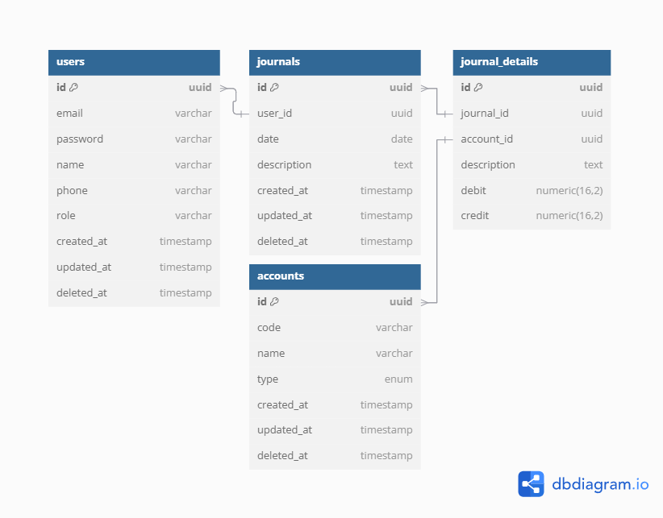

# 📘 Dokumentasi Perencanaan Aplikasi Akuntansi

## 1. 🎯 Visi & Misi

### Nama Aplikasi
Go Acounting

### Visi
Menyediakan solusi akuntansi sederhana, cepat, dan andal.

### Misi
- Menyediakan pencatatan transaksi keuangan berbasis jurnal umum.
- Menyediakan laporan keuangan standar sesuai prinsip akuntansi.
- Memastikan keamanan dan integritas data.

---

## 2. ✅ Fitur Utama

- [ ] Autentikasi dan otorisasi pengguna (JWT)
- [ ] Manajemen akun (Chart of Accounts / COA)
- [ ] Modul jurnal umum dan entri transaksi
- [ ] Laporan keuangan:
  - Neraca
  - Laporan laba rugi
  - Arus kas
  - Buku besar
- [ ] Multi-perusahaan (opsional)
- [ ] Multi-user per perusahaan (opsional)
- [ ] Periode akuntansi (opsional: tutup buku bulanan)

---

## 3. 🗃️ Entity Relationship Diagram (ERD)

### Entitas dan Relasi

- `users` - pengguna aplikasi
- `accounts` - daftar akun (COA)
- `journals` - transaksi jurnal
- `journal_details` - baris debit/kredit untuk setiap jurnal
- `transactions` (opsional: representasi transaksi bisnis)




---

## 4. 🏛️ Arsitektur Aplikasi

### Struktur Direktori (Clean Architecture)
```text
Go-Accounting/
│
├── cmd/    ()               # Entry point (main.go)
│   └── server/             # Inisialisasi Fiber, DB, middleware, route
│       └── main.go
│
├── config/                 # Konfigurasi environment, DB, dsb
│   └── config.go
│
├── internal/               # Logika aplikasi utama
│   ├── account/            # Modul Account (COA)
│   │   ├── model.go
│   │   ├── repository.go
│   │   ├── usecase.go
│   │   └── handler.go
│   │
│   ├── journal/            # Modul Journal
│   │   ├── model.go
│   │   ├── repository.go
│   │   ├── usecase.go
│   │   └── handler.go
│   │
│   ├── user/               # Modul User (pengguna)
│   │   ├── model.go
│   │   ├── repository.go
│   │   ├── usecase.go
│   │   └── handler.go
│   │
│   └── shared/             # Utilitas umum (middleware, validator, error)
│       ├── response.go
│       └── error.go
│
├── migrations/             # SQL atau Go untuk migrasi DB
│   └── init_schema.sql
│
├── scripts/                # Script CLI (misal: seed, init-data)
│   └── seed.go
│
├── go.mod
└── README.md
```

---------------


---

# 5. 📘 API Specification - Accounting App

## 🌐 Base URL
http://localhost:3000/api/v1

---

## 🔐 Authentication

(Opsional jika ingin menggunakan JWT)

### 🔑 Login

**POST** `/user/login`

#### Request
```json
{
  "email": "john@example.com",
  "password": "secret123"
}
```
#### Response
```json
{
  "token": "jwt-token",
  "user": {
    "id": "uuid",
    "name": "john doe",
    "role": "staff"
  }
}
```

### 👤 Users
➕ Create User
**POST** `/user/regiser`

#### Request
```json
{
  "name": "John Doe",
  "email": "john@example.com",
  "password": "secret123",
  "confirm_password": "secret123",
  "phone": "08123456789",
}
```
#### Response
```json
{
  "id": "uuid",
  "name": "John Doe",
  "email": "john@example.com",
  "phone": "08123456789",
  "role": "staff", // default role
  "status": "not_active" // need to be activated by admin
}
```

### 📄 Get All Users
**GET** `/users?page=1&limit=10`

Response
```json
{
    "data": [
        {
            "id": "uid",
            "name": "zolah",
            "email": "zolah@mail.com",
            "role": "admin",
            "phone": "12345456789",
            "status": "active"
        },
        {
            "id": "uid",
            "name": "zolah2",
            "email": "zolah2@mail.com",
            "role": "staff",
            "phone": "0987654321",
            "status": "not_active"
        }
    ],
    "pagination": {
        "page": 1,
        "limit": 10,
        "total": 2
    }
}
```

## 📒 Accounts
### ➕ Create Account
**POST** `/accounts`

Request
```json
{
  "code": "1001",
  "name": "Kas",
  "type": "asset"
}
```
Response
```json
{
  "code": "1001",
  "name": "Kas",
  "type": "asset"
}
```

## 📄 Get All Accounts
**GET** `/accounts`

Response
```json
{
  "id": "uuid",
  "code": "1001",
  "name": "Kas",
  "type": "asset"
}
```

## 📓 Journals
### ➕ Create Journal
**POST** `/journals`

Request
```json
{
  "date": "2025-06-10",
  "description": "Setoran modal awal",
  "details": [
    {
      "account_id": "uuid-of-kas",
      "debit": 10000000,
      "credit": 0
    },
    {
      "account_id": "uuid-of-modal",
      "debit": 0,
      "credit": 10000000
    }
  ]
}
```
Response
```json
{
  "id": "uuid",
  "date": "2025-06-10",
  "description": "Setoran modal awal",
  "details": [
    {
      "account_id": "uuid-of-kas",
      "debit": 10000000,
      "credit": 0
    },
    {
      "account_id": "uuid-of-modal",
      "debit": 0,
      "credit": 10000000
    }
  ]
}
```

### 📄 Get All Journals
GET /journals

Response
```json
[
  {
    "id": "uuid",
    "date": "2025-06-10",
    "description": "Setoran modal awal",
    "details": [
      {
        "account_id": "uuid",
        "account_name": "Kas",
        "debit": 10000000,
        "credit": 0
      },
      {
        "account_id": "uuid",
        "account_name": "Modal",
        "debit": 0,
        "credit": 10000000
      }
    ]
  }
]
```
### 🔍 Get Journal by ID
**GET** `/journals/{id}`

Response
```json
{
  "id": "uuid",
  "date": "2025-06-10",
  "description": "Setoran modal awal",
  "details": [
    {
      "account_id": "uuid",
      "account_name": "Kas",
      "debit": 10000000,
      "credit": 0
    },
    {
      "account_id": "uuid",
      "account_name": "Modal",
      "debit": 0,
      "credit": 10000000
    }
  ]
}
```
### ⚠️ Error Format
```json
{
  "error": "Validation failed",
  "details": "Total debit must equal total credit"
}
```
## 🧾 Optional Endpoints
### 🔄 Update Account
PUT /accounts/{id}

### ❌ Delete Account
DELETE /accounts/{id}


# 6. 📏 Aturan Validasi & Akuntansi
Setiap jurnal harus seimbang: total debit = total kredit

Akun tipe header atau non-posting tidak boleh digunakan dalam detail jurnal

Akun aktif, pasif, modal, pendapatan, beban sesuai prinsip standar

Tidak boleh input jurnal pada periode yang sudah ditutup

# 7. 🔄 User Flow 
Flow:
Login → Dashboard

Buat  jurnal

Lihat laporan

Tools:
Gunakan Figma, Whimsical, atau Excalidraw untuk membuat mockup

# 8. ⚙️ Konfigurasi & Deployment
Teknologi
Backend: Go + Fiber

ORM: GORM

Database: PostgreSQL

Auth: JWT

Deployment: Docker

Environment (contoh .env)
```text
PORT=3000
DB_HOST=localhost
DB_PORT=5432
DB_USER=casaos
DB_PASS=casaos
DB_NAME=go_accounting
JWT_SECRET=temporarykey
```